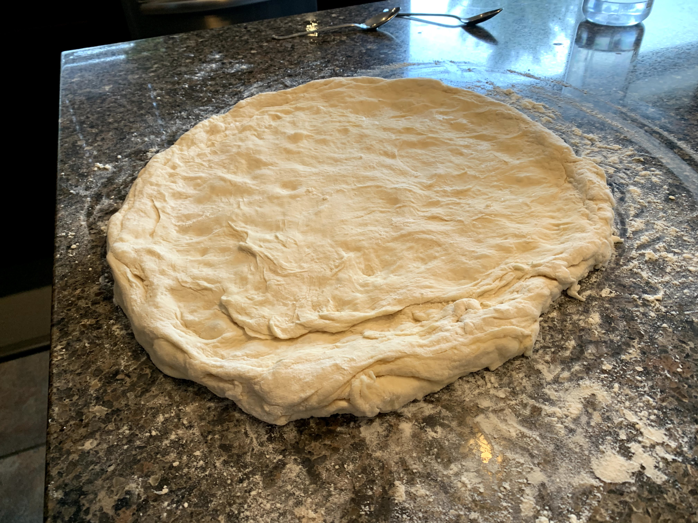

Today I felt like making some fresh pizza dough. It's quite a simple recipe mostly becayse I really
don't follow a recipe at all.

- 3 to 4 cups of flour 
- around 1 and 1/2 cups of water
- 2 tablespoons of sugar 
- some salt 
- package of yeast (bit more than 2 teaspoons)
- Some olive oil

1. Warm up water, stir in the sugar and then put in the yeast. Let sit for around 10 minutes.

2. Sift all other ingreidents together and then put it all in a mixing bowl, and mix. I used a standing
mixer with a dough hook. Feel free to add some olive oil.

3. When dough comes together take it out with floured hands and form into a big ball and let it rise.
The longer you let it rise the better. I waited as long as it took me to play with my dog and then take her for a walk. 
So about an hour and a half.

4. Once the dough has risen form into either one gigantic pizza or two normal sizes pizzas. I opted for the giant one 
because I felt like it.

5. Next place whatever you want on the pizza. I went with tomatos, prawns, mushroooms, red pepper and spinach. Throw some
cheese ontop and call it a day.

6. Eat the pizza.

7. Go back to step 1. if still hungry.
